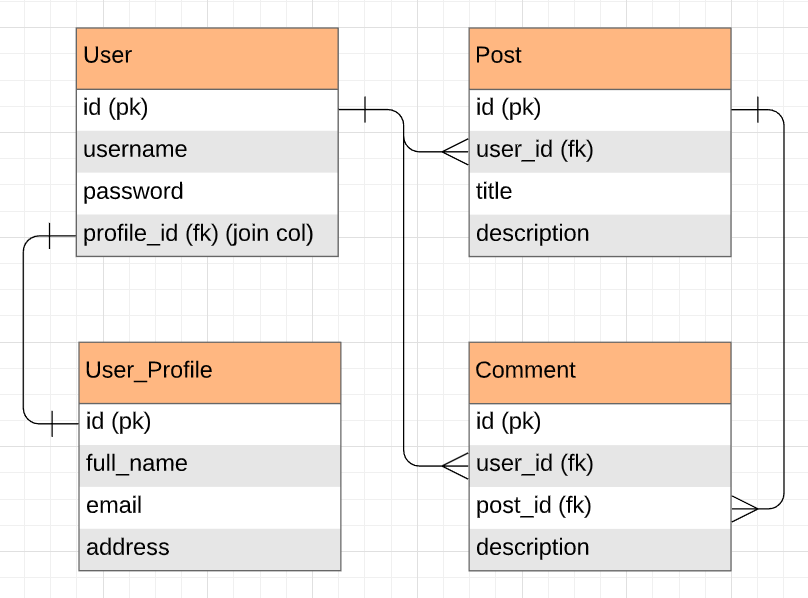

# Officey-Full-Stack
Officey, but now featuring a back-end!

# Team Members
- Iqbal Anwar (@<a href = "https://github.com/iqbalanwar">iqbalanwar</a>) 
- Santiago Ulloa (@<a href="https://github.com/sulloa13">sulloa13</a>) 
  
# Design Decisions
 

# Completions

| Day            | 1 - Friday                                           | 2 - Monday                                           | 3 - Tuesday                                         | 4 - Wednesday                                       |5 - Friday                                           |
|----------------|--------------------------------------|----------------------------------------------|-----------------------------------------------------|-------------------------------------------------------|------|
| Goals  | Get a user signup/login to work Set up post/comment tables | Get the post/comment to work on postman Set up user profile | Work on Front-End of signup/login | |
| Task Completed  | User signup/login | Posts to work on postman Set up user profile |  |   |  |
| To Do List  | Set up post/comment tables | Comments/Testing/Front-end |  |   |  |

# Challenges

We flag our issues on Github. 

# Reflection 

## Technical Requirements

Students' apps must:

- Persist at least **three models** (`User`, `Post`, `Comment`) to a PostgreSQL database.
- Use Spring Profiles to have **different profiles** for each environment.
- Use  **JSON Web Tokens** in Spring Security to power user authentication.
- **Protect the routes** with JWT, except for user sign-up and login.
- Expose APIs to perform **user login and sign-up**.
- Expose APIs to view and create a **user profile**.
- Expose APIs to **list posts and comments** made by a user.
- Expose APIs to perform **create, read, and delete actions** on user posts.
- Expose APIs to **create a comment** on a user post and delete that comment.
- Expose CRUD routes that were built using **REST conventions**.
- **Handle exceptions** gracefully.
- Send appropriate messages back to the client in the event that an exception occurs.
- Have complete **unit tests** that use mocks and stubs for at least one `Controller` and one `Service` class.
- Create **updated routes in the front-end** to connect to your newly built back-end (replacing the previously provided back-end from Project 1).
- Stick with the **KISS** (keep it simple, stupid) and **DRY** (don't repeat yourself) principles.

### Bonus Ideas
- Expose an API to update their own user profile.
- Add more unit tests.
- Implement integration tests.
- Allow a user to update their password.
- Allow a user to add a comment within another comment.

## Necessary Deliverables

- User stories to show the the work breakdown and project deliverables.
- A Git repository hosted on GitHub.
- Around 50 commits (or more) on GitHub, dating back to the very beginning of the project. (Commit early, commit often. Tell a story with your commits. Each message should give a clear idea of what you changed.)
- A `README.md` file with:
	- Explanations of the technologies used.
	- A couple of paragraphs about the general approach you took.
	- Descriptions of any unsolved problems or major hurdles you had to overcome.
	- A link to your planning documentation for how you broke down this project with deliverables and timelines.
	- Installation instructions for any dependencies.
	- A link to your user stories — who are your users, what do they want, and why?
	- A link to your wireframes — sketches of major views and interfaces in your application that may have been necessary to add after Project 1.
- A **10-minute** presentation, illustrating:
	- Your `README.md`.
	- Unit testing, by running at least one set of tests.
	- Triumphs.
	- Challenges.
